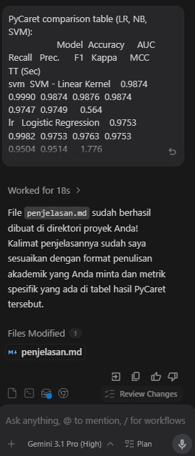

Both are website UI and Deep Learning & Machine Learning Model created with help of AI Agent

1. Streamlit Website: Claude Opus 4.7 (Via Cursor)
2. Machine Learning Model: Manual tune and Gemini via Antigravity
2. Deep Learning Model: Manual tune and GPT-4 via Cursor

Example prompt:

1. Generate classification report

```txt
PyCaret comparison table (LR, NB, SVM):
                   Model  Accuracy     AUC  Recall   Prec.      F1   Kappa     MCC  TT (Sec)
svm  SVM - Linear Kernel    0.9874  0.9990  0.9874  0.9876  0.9874  0.9747  0.9749     0.564
lr   Logistic Regression    0.9753  0.9982  0.9753  0.9763  0.9753  0.9504  0.9514     1.776
nb           Naive Bayes    0.9449  0.9441  0.9449  0.9456  0.9448  0.8892  0.8901     1.251

buatkan file bernama penjelasan .md, jelaskan classification report yang saya kirimkan diatass dalam bentuk paragraf yang berisi 1 sampai 3 kalimat dalam tiap model yang ada. Buatkan kalimatnya seperti ini:
Three machine learning models LightGBM, Random Forest, and SVM are evaluated on the same TF-IDF features.
Validation results are used for model selection, and test results for generalization assessment.
LightGBM. As a boosting-based baseline, LightGBM trains fastest but performs worst, with 57.35% validation
accuracy, 49.67% test accuracy, and a 48.46% F1-score. These results show that LightGBM is not suited for
this feature space.
```

