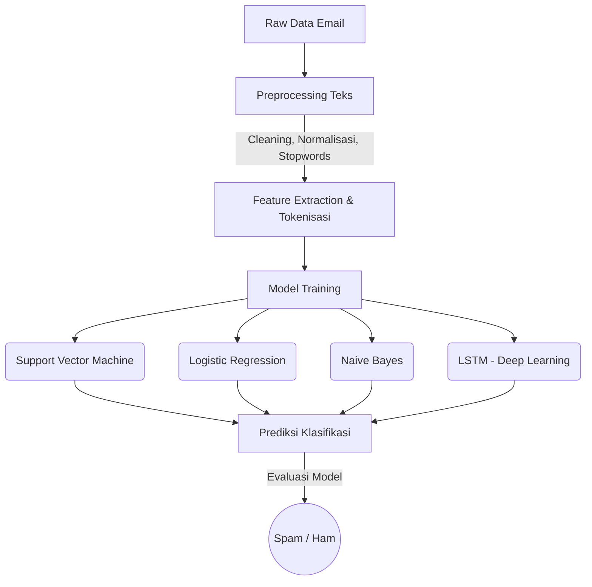

<div align="center">

# 📧 Deteksi Spam Email Indonesia

### Pemrosesan Bahasa Alami — Kelompok Kartini

Klasifikasi email **Spam** atau **Ham** (bukan spam) berbahasa Indonesia menggunakan NLP dan Deep Learning.

[](https://streamlit.io)
[](https://pytorch.org)
[](https://huggingface.co/spaces/diosamuel/spam-indonesia-email-detect)
[](LICENSE)

</div>

---

## 📖 Deskripsi Proyek

Proyek ini merupakan sistem klasifikasi email spam berbahasa Indonesia berbasis *Machine Learning* dan *Deep Learning*. Sistem dikembangkan untuk mendeteksi apakah sebuah email termasuk kategori spam atau non-spam (ham) melalui serangkaian tahapan komprehensif:

- **Preprocessing Teks:** Pembersihan karakter, normalisasi teks, dan penghapusan *stopwords*.
- **Feature Extraction:** Ekstraksi fitur menggunakan algoritma pemrosesan teks tingkat lanjut.
- **Klasifikasi:** Menggunakan algoritma *Support Vector Machine (SVM)*, *Naive Bayes*, *Logistic Regression*, dan jaringan *Long Short-Term Memory (LSTM)*.
- **Deployment:** Dilengkapi dengan antarmuka web interaktif menggunakan Streamlit dan siap di-*deploy* menggunakan Docker.

## 📊 Dataset

Dataset yang digunakan bersumber dari Kaggle yang berisi kumpulan email berbahasa Indonesia. Dataset ini merupakan hasil adaptasi dan penerjemahan dari dataset spam email publik ke dalam Bahasa Indonesia.

🔗 **Tautan Dataset:** [Indonesian Email Spam (Kaggle)](https://www.kaggle.com/datasets/gevabriel/indonesian-email-spam)

## ⚙️ Pipeline Pemrosesan



## ✨ Fitur Utama

- Antarmuka web interaktif dan *user-friendly* via Streamlit.
- Analisis perbandingan kinerja berbagai model ML dan DL.
- *Deploy-ready* dengan Docker & HuggingFace Spaces.

## 🛠️ Tech Stack

| Komponen | Teknologi |
|---|---|
| **Framework UI** | Streamlit |
| **Deep Learning**| PyTorch |
| **NLP & ML**     | Sastrawi, PyCaret, scikit-learn |
| **Deployment**   | Docker, HuggingFace Spaces |

## 🚀 Cara Menjalankan

### Cara 1: Menggunakan Python Lokal (Disarankan)

```bash
# 1. Clone repository
git clone https://github.com/diosamuel/pba2026-kelompoknyaKartini.git
cd pba2026-kelompoknyaKartini

# 2. Buat Virtual Environment & Install dependencies
python -m venv venv
.\venv\Scripts\activate  # Untuk pengguna Windows
pip install -r requirements.txt

# 3. Jalankan aplikasi web
streamlit run src/program/app.py
```

### Cara 2: Menggunakan Docker

```bash
# Build image
docker build -t spam-email-detect .

# Jalankan container
docker run -p 8501:8501 spam-email-detect
```

## 👥 Anggota Kelompok

| Nama | NIM | GitHub |
|---|---|---|
| Virdio Samuel Saragih | 122450124 | [@diosamuel](https://github.com/diosamuel) |
| Baruna Abirawa | 122450097 | [@barunaxyz](https://github.com/barunaxyz) |
| Kartini Lovian Simbolon | 122450003 | [@kartinils](https://github.com/kartinils) |

## 🔗 Tautan Penting

| Deskripsi | URL |
|---|---|
| **GitHub Repo** | [pba2026-kelompoknyaKartini](https://github.com/diosamuel/pba2026-kelompoknyaKartini) |
| **HuggingFace Model** | [spam-indonesia-email-detect](https://huggingface.co/diosamuel/spam-indonesia-email-detect) |
| **Live Demo (Web)** | [HuggingFace Space](https://huggingface.co/spaces/diosamuel/spam-indonesia-email-detect) |
| **Paper / Jurnal** | [Arxiv Link](https://arxiv.org/abs/2605.03440) |

---

<div align="center">

Dibuat oleh **Kelompok Kartini** — PBA 2026

</div>
